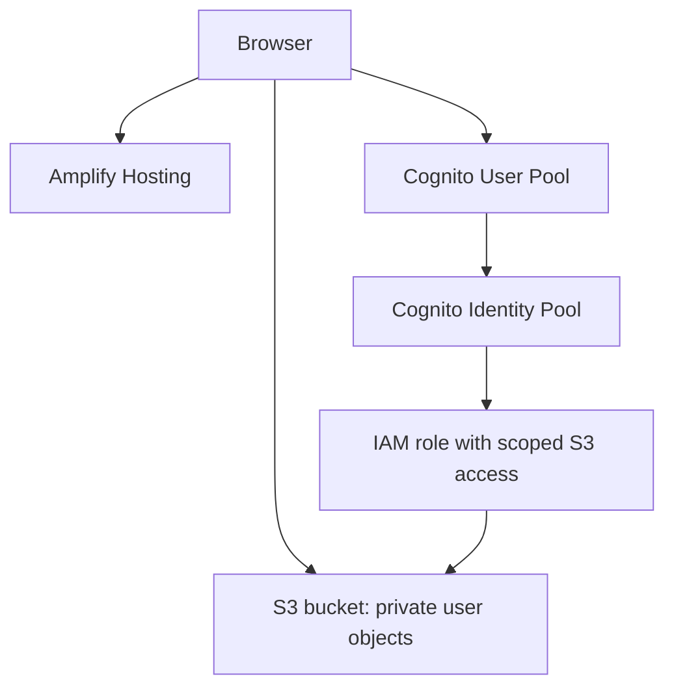

# My Files — Personal Cloud Storage on AWS

A browser-based file manager deployed with AWS Amplify Hosting. Amazon Cognito handles account sign-up and sign-in, a Cognito Identity Pool provides temporary AWS credentials, and Amazon S3 stores each user's files. The frontend is a single `index.html` file.

**Project files:** `index.html` is the editable site; `index.zip` is the original deployment ZIP supplied for this project. `aws/iam-policy.json` and `aws/s3-cors.json` are corrected reference configurations. The original screenshots and uploaded personal files are not included in this repository.

## Features

- Email sign-up, confirmation, sign-in, password reset and sign-out
- Drag-and-drop or multi-file upload with progress (client-side limit: 200 MB per file)
- List, search, sort, download and delete files
- Rename a new upload when its name already exists in the current file list
- Amplify Storage `private` level for per-user object paths

## Architecture



## Resource mapping in the supplied project

| Setting | Value in `index.html` | Evidence available |
| --- | --- | --- |
| Region | `eu-north-1` | Cognito and S3 screenshots show Stockholm |
| Cognito User Pool | `eu-north-1_2f2OkNE4D` | Matches the User Pool screenshot |
| User Pool app client | `45hkac7ch386gq1eaj0r9a31d0` | Present in code; console app-client page not supplied |
| Cognito Identity Pool | `eu-north-1:203d7840-8ece-4112-8597-193a35c5bb17` | Present in code; Identity Pool page not supplied |
| S3 bucket | `drop-box-demo` | Matches the S3 screenshot |
| IAM role | `drop-box-role` | Role name visible in IAM screenshot; a policy pasted later uses a different bucket ARN |

These IDs are configuration identifiers, not passwords. The screenshots do not prove that the app client belongs to this User Pool or that the Identity Pool trusts this User Pool and app client. Verify those relationships in AWS before claiming the setup is secure. Never commit AWS access keys, passwords, or real user files.

## Important configuration mismatches to fix before a production demo

The IAM policy provided for this project points to `my-dropbox-files-123456`, while the website code and bucket screenshot use `drop-box-demo`. If this is the attached policy on the authenticated role, S3 uploads/listing/downloads will be denied unless another permission grants access. Replace **both** occurrences of the bucket name in the policy with the real bucket name. If the pasted policy was only an old example, inspect the actual attached policy first.

The corrected copy is in [`aws/iam-policy.json`](aws/iam-policy.json).

The supplied S3 CORS rule allows `https://staging.d1jrzjjfclnkfp.amplifyapp.com`, while the website screenshot shows `https://staging.d3m7niyax2tq7o.amplifyapp.com`. Browser requests from the pictured site need its exact origin in `AllowedOrigins`; add any other genuine deployment origins separately. Remove unused origins after checking them.

The corrected copy is in [`aws/s3-cors.json`](aws/s3-cors.json). These JSON files are reference configurations; committing them to GitHub does not update AWS resources.

### Example identity-scoped IAM permissions for the pictured bucket

Confirm that this policy is attached to the **authenticated** Identity Pool role and that its trust policy restricts access to the intended Identity Pool and authenticated users. The role name alone cannot establish this. This example follows the `private/{identityId}/` path used by Amplify Storage v4.

```json
{
  "Version": "2012-10-17",
  "Statement": [
    {
      "Effect": "Allow",
      "Action": ["s3:PutObject", "s3:GetObject", "s3:DeleteObject"],
      "Resource": "arn:aws:s3:::drop-box-demo/private/${cognito-identity.amazonaws.com:sub}/*"
    },
    {
      "Effect": "Allow",
      "Action": "s3:ListBucket",
      "Resource": "arn:aws:s3:::drop-box-demo",
      "Condition": {
        "StringLike": {
          "s3:prefix": [
            "private/${cognito-identity.amazonaws.com:sub}/",
            "private/${cognito-identity.amazonaws.com:sub}/*"
          ]
        }
      }
    }
  ]
}
```

### Example CORS for the pictured Amplify staging site

```json
[
  {
    "AllowedHeaders": ["*"],
    "AllowedMethods": ["GET", "PUT", "POST", "DELETE", "HEAD"],
    "AllowedOrigins": ["https://staging.d3m7niyax2tq7o.amplifyapp.com"],
    "ExposeHeaders": ["ETag", "x-amz-server-side-encryption", "x-amz-request-id", "x-amz-id-2"],
    "MaxAgeSeconds": 3000
  }
]
```

CORS controls which web origins may make browser requests; it does not grant S3 access. The IAM policy and bucket settings still enforce authorization. Keep `http://localhost:8080` in `AllowedOrigins` only if you actually use that local development address.

## Deployment

These are the steps to **recreate** the project. AWS consoles change over time, so use the named settings even if a button's wording differs. Creating resources may incur AWS charges. If you recreate it in your own account, replace the sample IDs and bucket in `index.html` and the two JSON files with **your** resource values; you cannot reuse another account's pools and bucket.

### 1. Choose the region and create the bucket

1. Sign in to AWS Console and select **Europe (Stockholm), `eu-north-1`** at the top right.
2. Open **S3 → Buckets → Create bucket**. Choose a globally unique bucket name (`drop-box-demo` was used in this project) and the same region.
3. Leave **Block all public access** enabled. Create the bucket. This app uses signed-in AWS credentials; S3 does not need to be public.
4. Open the bucket → **Permissions → Cross-origin resource sharing (CORS)**. Paste `aws/s3-cors.json`, replacing its Amplify URL with the exact URL of your site if different. Save.

### 2. Set up email sign-in with a Cognito User Pool

1. Open **Amazon Cognito → User pools → Create user pool** in `eu-north-1`.
2. Set email as the sign-in identifier, enable self-registration and email confirmation as needed, and configure a password policy. Select settings appropriate for your test app.
3. Create a **public app client with no client secret**, because `index.html` runs in a browser.
4. Write down **User Pool ID** and **app client ID** from the pool's overview/app integration. This project's supplied values are in the mapping table above. Verify the client appears inside that same pool.

### 3. Connect an Identity Pool for S3 access

1. Open **Amazon Cognito → Identity pools → Create identity pool** in the same region.
2. Allow **authenticated access** and connect the User Pool from step 2 using its **exact app client ID**. Do not enable unauthenticated S3 access for this app.
3. Create or select an **authenticated IAM role** for the Identity Pool. Write down the Identity Pool ID and role name.
4. Verify the role's **trust relationship** names the intended Identity Pool and authenticated identities; do not infer this from the role name.
5. Open **IAM → Roles → authenticated role → Permissions**. Add a policy modeled on `aws/iam-policy.json`, with your actual bucket name. It grants read/write/delete only inside the current Cognito identity's `private/` prefix and scoped bucket listing. Ensure a broader attached policy does not bypass that isolation.

### 4. Connect all IDs in the frontend

Open `index.html`, find `Amplify.configure`, and verify the following connections:

```text
Auth.region                  = Cognito User Pool and Identity Pool region
Auth.userPoolId              = User Pool ID from step 2
Auth.userPoolWebClientId     = app client ID inside that User Pool
Auth.identityPoolId          = Identity Pool ID from step 3
Storage.AWSS3.bucket         = S3 bucket from step 1
Storage.AWSS3.region         = S3 bucket region
```

Do not put AWS access keys, a Cognito client secret, or a password in the HTML. Cognito Identity Pool obtains temporary credentials for a signed-in user.

### 5. Deploy with Amplify Hosting

1. Open **AWS Amplify → Create new app → Deploy without Git provider** (manual deployment).
2. Name the app/branch. Upload a ZIP with `index.html` at the ZIP root. The original `index.zip` is supplied here; if you edit the HTML, create a **new** ZIP from the edited `index.html` instead of reusing the old archive.
3. After deployment, open the exact `https://...amplifyapp.com` URL. Add that origin to the bucket CORS rule if it differs from `aws/s3-cors.json`.
4. Create a test account, confirm its email, sign in, upload a harmless file, refresh, download it and delete it.

### 6. Check privacy using two users

Create account A and account B with different emails. Upload a file as A, sign out, then sign in as B. B should see an empty list and must not be able to access A's object. Sign back in as A and check that the file remains available. Review S3 object keys and IAM policy in the console if this test fails. A browser display alone is not proof that access is blocked.

## Verification checklist

1. In Cognito **User pools → app integration → app clients**, confirm the configured client ID belongs to User Pool `eu-north-1_2f2OkNE4D` and has no client secret.
2. In Cognito **Identity pools**, confirm the configured Identity Pool ID and its User Pool provider/client ID match the same values in `index.html`.
3. Open the Identity Pool's authenticated role and verify its trust policy and S3 permissions. Resolve the bucket-name mismatch above. Check that S3 actions and object prefixes are scoped to the authenticated identity; review bucket CORS and public access settings and resolve the domain mismatch.
4. Create two separate test accounts. Upload a harmless file with account A. Sign out and sign in as B: B must not list, download or delete A's file. Then check A can still access it.
5. Test sign-up confirmation, password reset, duplicate filenames, download, delete, a file over 200 MB, and mobile layout. Confirm a file survives sign-out and sign-in.

The supplied frontend, screenshots, and pasted IAM/CORS policies were reviewed for this draft. Live AWS configuration and multi-user isolation have not yet been independently tested.

## Known limits and next steps

- The 200 MB limit is enforced in the browser UI, not as an S3 quota.
- Search and sorting operate on files returned to this browser; there are no folders, share links, file previews, or version history.
- Repeated uploads from multiple tabs can still race on the same name. An S3 key with a random ID and separate display-name metadata would make naming more robust.
- Add screenshots with private email addresses and account details hidden, plus an architecture diagram and test evidence, for a polished GitHub portfolio entry.
